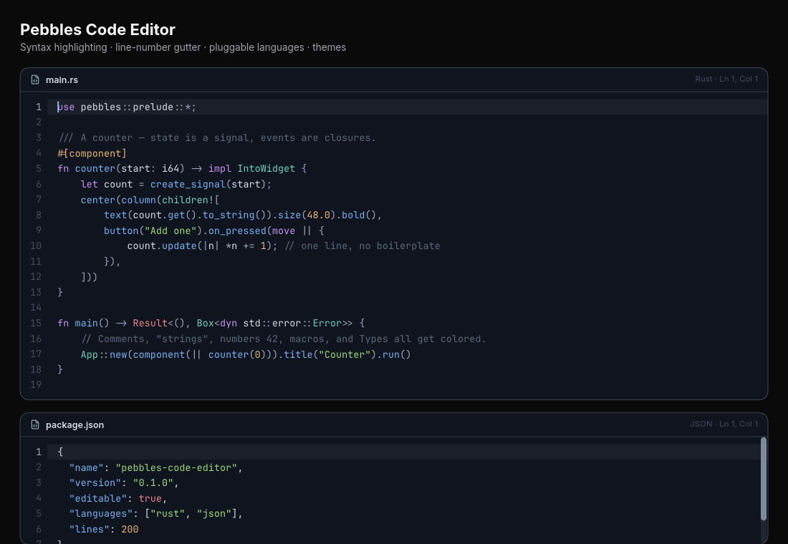

# pebbles-code-editor

An embeddable, syntax-highlighting **code editor** widget for the
[Pebbles](https://github.com/pebbles-hq/pebbles) GUI framework — built to be the
foundation an IDE or code-first tool can grow on.

Like every serious editor (CodeMirror, Monaco, AvaloniaEdit), it's a **custom editing
engine** — it owns the buffer, cursor, selection, layout, and input rather than reusing
the framework's text field. Code is monospace, so it renders on a fixed grid, which
keeps caret placement and click hit-testing exact and cheap.



```rust
use pebbles::prelude::*;
use pebbles_code_editor::{code_editor, lang::Rust, EditorTheme};

fn view() -> impl IntoWidget {
    let code = create_signal(String::from("fn main() {}\n"));
    code_editor(code)
        .language(Box::new(Rust))
        .theme(EditorTheme::dark())
        .title("main.rs")
        .autofocus()
        .height(420.0)
}
```

## Features

- **Real editing** — type, backspace / delete, word-delete (Ctrl+Backspace/Delete),
  Enter with **auto-indent**, arrows, word / line / document motions, **Shift-select**,
  Ctrl+A, and **Copy / Cut / Paste**. The buffer is the `Signal<String>` you pass in.
- **Mouse** — click to place the caret, drag to select.
- **Syntax highlighting** via a pluggable [`Language`] layer — **Rust** and **JSON**
  bundled; add a grammar by implementing one trait method.
- **Gutter** with an active-line marker, **current-line highlight**, selection, caret,
  and a status bar (filename · language · line/col).
- **Themes** (`EditorTheme`) — `dark` and `light` bundled, or build your own.
- Read-only mode (`.read_only(true)`) — still navigable, selectable, copyable.

## Extending it — add a language

A highlighter is a function from source to tagged byte ranges:

```rust
use pebbles_code_editor::lang::{Language, Token, TokenKind};

struct Toml;
impl Language for Toml {
    fn name(&self) -> &str { "TOML" }
    fn highlight(&self, src: &str) -> Vec<Token> {
        // scan `src`, push Token { start, len, kind } for keywords, strings, …
        Vec::new()
    }
}
```

The editor maps each [`TokenKind`] to a color through the active theme, so a new
language highlights the moment you return its tokens. The bundled scanners are
hand-written, dependency-free, and **panic-free on any input** (an editor is full of
half-typed, invalid source).

## Run the sample

```sh
cargo run -p demo
# headless screenshot (no display needed):
SHOT=1100:760:/tmp/editor.rgba cargo run -p demo
```

## Status & roadmap

The editing engine, highlighting, gutter, selection, caret, and mouse are working today.
Known limitations and what's next, toward CodeMirror-grade:

- **Undo / redo** and IME composition.
- **Caret blink** and viewport scroll-to-caret on keyboard navigation.
- Horizontal scrolling for very long lines (they currently extend past the viewport).
- Bracket matching, code folding, search / replace, multiple selections.
- A completion / diagnostics surface an LSP client can drive.
- Glyph-accurate metrics (v1 uses a monospace advance ratio; fine for mono fonts, and
  the one spot to refine for proportional or ligature-heavy fonts).

## License

MIT OR Apache-2.0.
